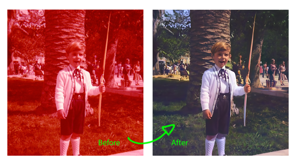

# Photo Restoration Python script



One of those 'scratching my own itch' type of Github repo. A comprehensive solution for restoring and enhancing old photographs using open-source AI models on rented GPUs. This suite combines colorization and face restoration techniques to breathe new life into your old family photos. Just did a batch of c. 350 family photos and 

## Features

- **Photo Colorization**: 
  - Colorize black & white photos
  - Convert red-tinted photos (degraded film) to black & white, then colorize them
- **Face Restoration**: 
  - Enhance and restore face details using GFPGAN model
  - Fix blurry, low-quality, or damaged facial features
- **Batch Processing**:
  - Process multiple photos at once
  - Progress tracking with status updates
- **Docker Support**:
  - Easy deployment with Docker, so you do not have to mess around dependecies and that kind of stuff
  - Consistent environment across platforms

## Output

After processing completes, you'll find:
- Colorized photos in the `colorized/` directory
- Restored photos in the `gfpgan/` directory
- Original photos remain unchanged in their respective directories

## Models Used

- **Colorization**: DDColor model via Replicate API
- **Face Restoration**: GFPGAN v1.4 via Replicate API


## Running with Docker

To run the application using Docker:

1. Rename .env-template to .env using the following command, then add your Replicate API token to the `.env` file:
   ```bash
   mv .env-template .env
   ```

2. Place your photos in the appropriate folders:
   - Black & white photos go in `photos/bn/`
   - Red-tinted photos go in `photos/red/`
   - Any other photos go in `photos/`

3. Build and start the container:
   ```bash
   docker compose up --build
   ```
   - Progress will be displayed in the console
   - Results will appear in the output directories
   - The process will take a few minutes to complete and the container will stop automatically

4. Enhanced results are saved in the `gfpgan/` directory


## Troubleshooting

1. **API Token Issues**:
   - Ensure your Replicate API token is valid
   - Check if the token is properly set in the `.env` file

## How It Works

The restoration process happens in two stages:

1. **Colorization Stage**:
   - Black & white photos (in `photos/bn/`) are colorized
   - Red-tinted photos (or any other color resulting from chemical degradation of the film) (in `photos/red/`) are converted to B&W, then colorized
   - Results are saved in both `colorized/` and `photos/` directories

2. **Face Restoration Stage**:
   - All photos (including newly colorized ones) are processed with GFPGAN model


